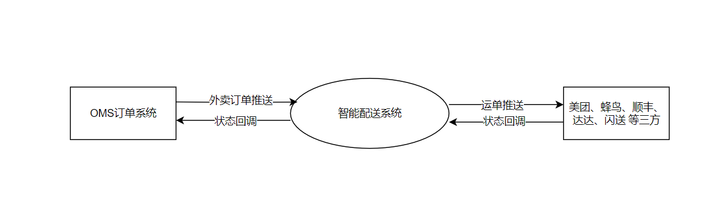
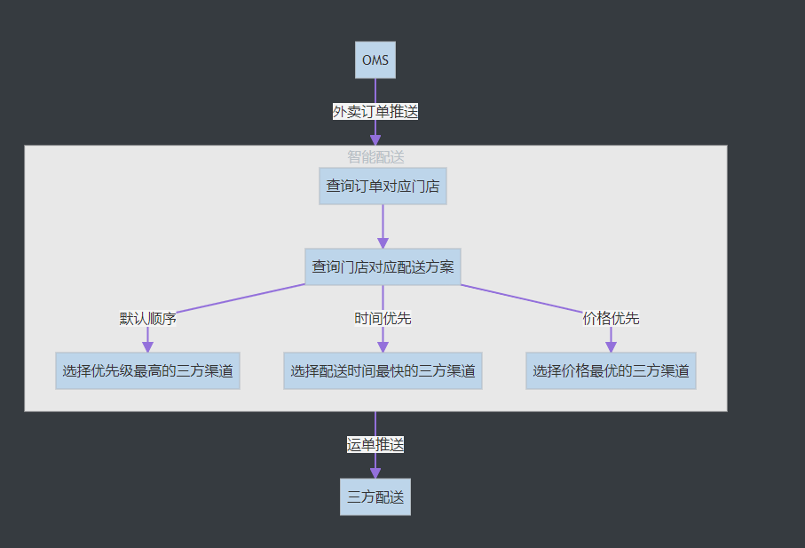

# fast-delivery - 智能配送系统

fast-delivery 是对接三方配送, 并负责配送的调度

* [**api**](https://github.com/eeaters/fast-delivery/tree/master/api) :
后端服务
* [**web**](https://github.com/eeaters/fast-delivery/tree/master/web) : 
前端服务

## 顶层图

## 订单推送流程图

## Getting Started

- 初始化数据库
- 修改yml配置
- 运行后端服务
- 运行前端服务
