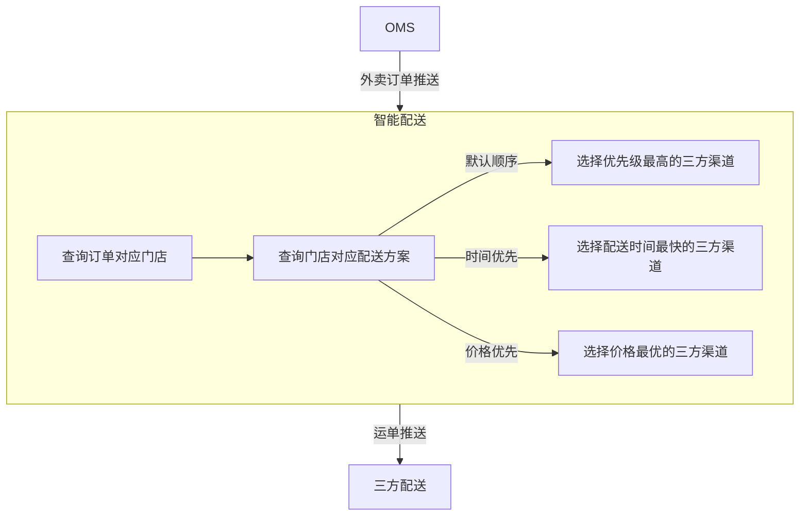

```mermaid
graph TD

OMS --外卖订单推送 --> 智能配送
subgraph 智能配送
查询订单对应门店 --> 查询门店对应配送方案

查询门店对应配送方案 --默认顺序--> 选择优先级最高的三方渠道

查询门店对应配送方案 -- 时间优先 --> 选择配送时间最快的三方渠道

查询门店对应配送方案 --价格优先 --> 选择价格最优的三方渠道

end
智能配送 --运单推送--> 三方配送

```

